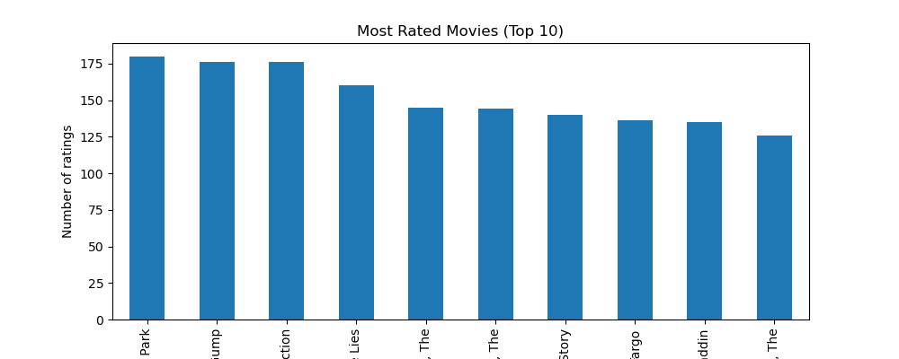
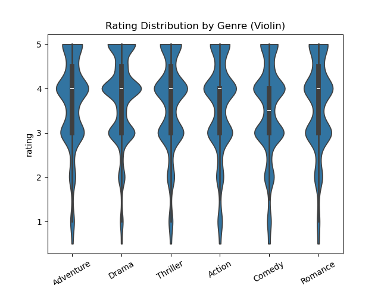

# 🎬 Movie Ratings Analysis

## 📌 Overview  
This project performs an **Exploratory Data Analysis (EDA)** on movie ratings data using **Python (Pandas & Matplotlib)**.  
The goal is to analyze user behavior, rating patterns, and genre popularity using pivot tables, groupby operations, and visualizations.

---
## 🧰 Tools & Libraries
- Python 3
- Pandas
- Matplotlib
- NumPy
- Jupyter Notebook or any Python IDE

---

## 📂 Dataset  
The dataset contains two main files:  
- **movies.csv** → Contains movie details (`movieId`, `title`, `genres`)  
- **ratings.csv** → Contains user ratings (`userId`, `movieId`, `rating`, `timestamp`)  

---

## 🖼️ Project Preview  

| Top Rated Movies | Ratings Distribution |
|------------------|-----------------------|
|  |  |

---

## ⚙️ Steps Performed  

1. **Importing Libraries**  
   - Pandas for data manipulation  
   - Matplotlib for data visualization  

2. **Loading the Data**  
   - Read CSV files into DataFrames  
   - Display first few rows  

3. **Data Cleaning & Preparation**  
   - Handle missing values  
   - Convert timestamps to readable date formats  
   - Merge `movies` and `ratings` on `movieId`  

4. **Exploratory Data Analysis (EDA)**  
   - Find most-rated movies  
   - Find average ratings per movie  
   - Analyze distribution of ratings  
   - Check genre-based rating trends  

5. **Pivot Tables & Groupby**  
   - Average rating per user  
   - Average rating per genre  
   - Most popular movies by count of ratings  

6. **Visualizations (Matplotlib)**  
   - Bar charts for most popular movies  
   - Histograms of ratings  
   - Rating trends over time  

---

## 📊 Key Insights  
✔️ Identified **top-rated movies** based on number of ratings  
✔️ Distribution shows users tend to give **higher ratings**  
✔️ Genres like **Drama** and **Comedy** dominate  
✔️ Pivot tables reveal **user preferences and trends**  

---

## 🛠️ Tech Stack  
- **Python**  
- **Pandas** → Data Manipulation  
- **Matplotlib** → Data Visualization  
- **Jupyter Notebook**  

---

## 🚀 How to Run the Project  

```bash
# Clone the repository or upload the `.ipynb` or `.py` file to your own GitHub

# Navigate into Python-mini-Projects folder
cd MovieRatingsAnalysis

# Install dependencies
pip install pandas matplotlib

# Run Jupyter Notebook
jupyter notebook MovieRatingsAnalysis.ipynb